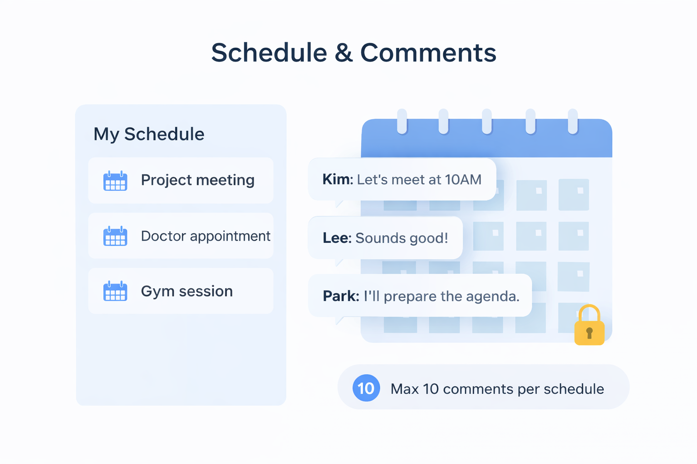
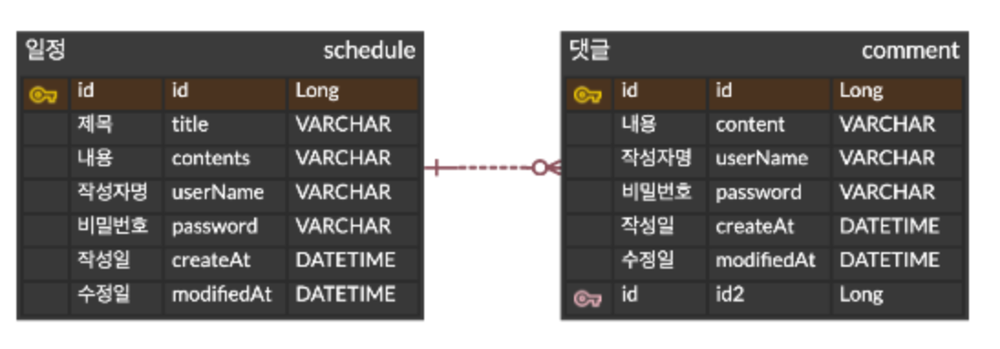

## CH 3 일정 관리 앱 만들기

### 1. 프로젝트 소개  
일정(Schedule)을 생성하고 관리할 수 있으며, 각 일정에 댓글(Comment)을 작성할 수 있는 REST API 서버입니다.
### 2. 주요 기능  
- 일정 생성
- 일정 조회(전체 조회, 단 건 조회)
- 일정 수정 (비밀번호 필요)
- 일정 삭제 (비밀번호 필요)
- 댓글 생성 (일정별 최대 10개 제한)
### 3. API 명세  
https://documenter.getpostman.com/view/53063172/2sBXitCnDV
### 4. ERD  

### 5. 구현 기능
- 비밀번호 기반 수정/삭제 검증 로직 구현
- JPA Auditing을 통한 생성/수정일 자동 관리
- 댓글 최대 10개 제한 기능 구현
- Schedule - Comment 1:N 관계 설계

### 6. 사용방법
1. 프로젝트 실행
- Spring Boot 애플리케이션을 실행합니다.
- 기본 서버 주소: http://localhost:8080

2. API 테스트
- Postman을 사용하여 API를 테스트할 수 있습니다.

### 7. 트러블슈팅  
https://velog.io/@gksekqls21/CH-3-일정-관리-앱-만들기-트러블슈팅

